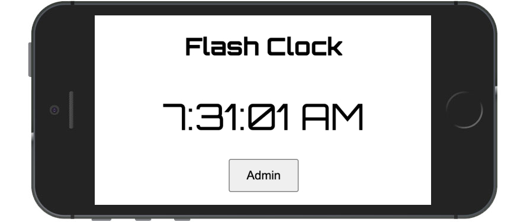

# Flash clock PWA
The classic clock with EXtras

## What It Is

A simple PWAi demo that displays the time  also it has 3 modes that will help productivity there is also option to disable the productivity mode also. This is how it works. It can project spped up the time in leanear and also exponentialy there is option to enable or disable the progression. Also there is a mode where you can randomize the leaar and exponential modes 

## Demo

https://missionode.github.io/pwai/index.html
